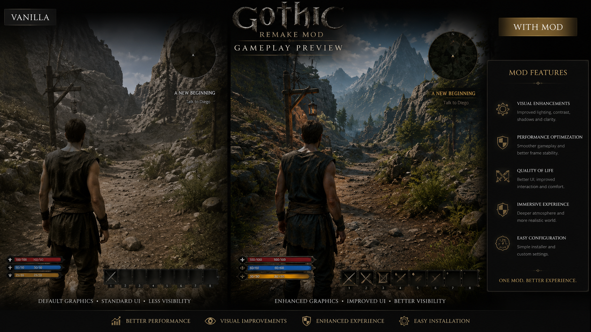
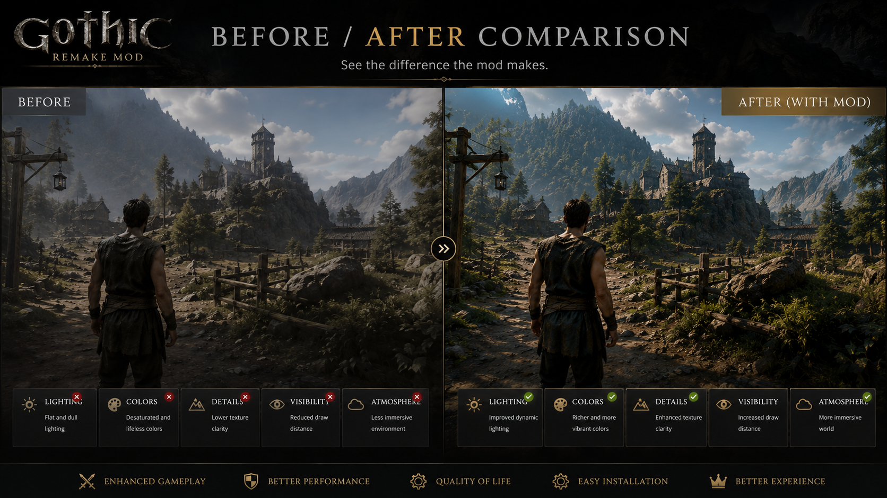

# gothic-remake-mod
Ultimate Gothic Remake enhancement mod with gameplay improvements, visual upgrades, quality-of-life features, and easy installer support.

# Gothic Remake Mod

<p align="center">
  
</p>

<h1 align="center">Gothic Remake Mod</h1>

<p align="center">
  A lightweight enhancement mod for Gothic Remake focused on smoother gameplay, better configuration, and an improved player experience.
</p>

<p align="center">
  
  
  
  
</p>

---

## Overview

Gothic Remake Mod is a Windows-based mod utility designed to improve the overall Gothic Remake experience with a simple installation process and clean configuration workflow.

The mod is packaged as an executable file and distributed through GitHub Releases for easy downloading and installation.

---

## Main Features

### Gameplay Enhancement

* Improved gameplay configuration
* Cleaner player experience
* Better quality-of-life settings
* Lightweight integration
* Easy setup process

### Visual Configuration

* Optional visual adjustment presets
* Improved clarity settings
* Better display configuration
* Cleaner in-game presentation

### Performance-Oriented Setup

* Lightweight installer
* Simple configuration files
* No unnecessary background services
* Designed for easy installation and removal

### User-Friendly Installer

* One EXE file in Releases
* Simple installation flow
* Clear folder selection
* Fast setup for Windows users

---

## Screenshots

### Gameplay Preview



### Before / After Comparison



---

## Installation

1. Go to the **Releases** section.
2. Download the latest ZIP archive.
3. Extract the archive.
4. Run `GothicRemakeMod.exe`.
5. Select your Gothic Remake installation folder.
6. Follow the installer instructions.
7. Launch the game.

---

## Download

Latest release file:

```text
Gothic-Remake-Mod.zip
```

Executable inside the archive:

```text
GothicRemakeMod.exe
```

---

## Recommended Folder Structure

```text
Gothic-Remake-Mod/
├── assets/
│   ├── banner.png
│   ├── screenshot-1.png
│   └── screenshot-2.png
├── src/
│   ├── ModInstaller.cs
│   ├── ConfigManager.cs
│   └── GamePathDetector.cs
├── docs/
│   ├── Installation.md
│   ├── FAQ.md
│   └── Troubleshooting.md
├── README.md
├── LICENSE
└── CHANGELOG.md
```

---

## Compatibility

* Windows 10
* Windows 11
* Gothic Remake installation
* Latest public game builds

---

## FAQ

### Is the mod installed through an EXE?

Yes. The mod is distributed as an executable installer inside the release ZIP archive.

### Does this modify save files?

No. The mod is designed to work without editing save files.

### Can I uninstall it?

Yes. You can remove the installed mod files or restore the original configuration.

### Is this official?

No. This is an independent community-made mod project.

---

## Roadmap

### v1.1.0

* Improved installer interface
* Better game path detection
* Additional configuration presets

### v1.2.0

* Backup and restore system
* More visual options
* Improved troubleshooting tools

### v2.0.0

* Advanced mod profile support
* Optional preset manager
* Extended compatibility tools

---

## Disclaimer

This is an unofficial community project and is not affiliated with the original developers or publishers of Gothic Remake.

Use at your own discretion and always keep backups of important files.

---

## License

Released under the MIT License.
